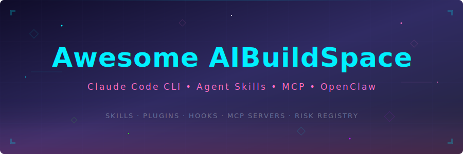

  

  &nbsp;
  &nbsp;
  &nbsp;
  

  &nbsp;
  &nbsp;
  &nbsp;
  

---

A practitioner-maintained directory for building with **Claude Code**, **OpenClaw**, **DeepAgents**, and the open **Agent Skills** standard. Skills you write once run everywhere — Claude Code CLI, Claude Desktop (Cowork), LangChain DeepAgents, and 10+ other runtimes. Every resource here includes known risks and limitations — because knowing what breaks is just as valuable as knowing what works.

**[r/AIBuildSpace](https://reddit.com/r/AIBuildSpace)** is the companion discussion community. This repo is the curated reference layer.

---

## Contents

- [Getting Started](#getting-started)
- [Browse by Topic](#browse-by-topic)
- [Claude Code CLI](#claude-code-cli)
- [Agent Skills — OpenClaw / DeepAgents / Cowork](#agent-skills--openclawcowork)
- [Community Skills Gallery](#community-skills-gallery)
- [Top Repos & References](#top-repos--references)
- [MCP Servers](#mcp-servers)
- [Risk Registry](#risk-registry)
- [Learning Resources](#learning-resources)
- [Contributing](#contributing)

---

## Browse by Topic

<table>
<tr>
  <td width="25%" align="center">
    <h3>⚡ Claude Code CLI</h3>
    <a href="#skills--slash-commands">Skills</a> ·
    <a href="#plugins">Plugins</a> ·
    <a href="#hooks">Hooks</a> ·
    <a href="#claudemd">CLAUDE.md</a>
      
    <em>Build custom commands, extend the CLI, and automate your dev workflow</em>
  </td>
  <td width="25%" align="center">
    <h3>🧠 Agent Skills</h3>
    <a href="#agent-skills--openclawcowork">OpenClaw</a> ·
    <a href="#agent-skills--openclawcowork">DeepAgents</a> ·
    <a href="#community-skills-gallery">Gallery</a>
      
    <em>Write once, run on Claude Code, OpenClaw, DeepAgents, Codex, Cursor & more</em>
  </td>
  <td width="25%" align="center">
    <h3>🔌 MCP Servers</h3>
    <a href="#mcp-servers">Official</a> ·
    <a href="#mcp-servers">Community</a> ·
    <a href="#mcp-servers">Tools</a>
      
    <em>Connect Claude to real-world data sources and external APIs</em>
  </td>
  <td width="25%" align="center">
    <h3>⚠️ Risk Registry</h3>
    <a href="#-risk-registry">Known Risks</a> ·
    <a href="RISK_REGISTRY.md">Full Registry</a> ·
    <a href="CONTRIBUTING.md#submitting-a-risk-registry-entry">Submit Risk</a>
      
    <em>Real failure modes, gotchas, and mitigations from the community</em>
  </td>
</tr>
<tr>
  <td width="25%" align="center">
    <h3>🌐 Top Repos</h3>
    <a href="#official-anthropic-repositories">Official</a> ·
    <a href="#community-curated-lists">Community</a> ·
    <a href="#open-standards">Standards</a>
      
    <em>The highest-signal repositories in the Claude ecosystem</em>
  </td>
  <td width="25%" align="center">
    <h3>📚 Learning</h3>
    <a href="#official-documentation">Docs</a> ·
    <a href="#deep-dives">Deep Dives</a> ·
    <a href="#community-guides">Guides</a>
      
    <em>From quickstart to production-grade agent architecture</em>
  </td>
  <td width="25%" align="center">
    <h3>🚀 Showcases</h3>
    <a href="#-community-showcases">Projects</a> ·
    <a href="CONTRIBUTING.md">Submit Yours</a>
      
    <em>Real builds with honest post-mortems — the good and the broken</em>
  </td>
</tr>
</table>

---

## Getting Started

1. **Install Claude Code** — [docs.anthropic.com/en/docs/claude-code](https://docs.anthropic.com/en/docs/claude-code)
2. **Browse skills** — drop community skills into `.claude/skills/` or install via plugins. Start with [anthropics/skills](https://github.com/anthropics/skills) (⭐ 37.5k) or [awesome-openclaw-skills](https://github.com/VoltAgent/awesome-openclaw-skills) (5,400+ skills).
3. **Connect tools via MCP** — browse [awesome-mcp-servers](https://github.com/punkpeye/awesome-mcp-servers) (⭐ 79.6k) and configure in `.mcp.json`.
4. **Read the risks** — check the [Risk Registry](RISK_REGISTRY.md) before going to production.

---

## Included Skills

This repo ships with **22 production-ready skills** in [`skills/`](skills/) — compatible with **Claude Code**, **OpenClaw**, and **[DeepAgents](https://github.com/langchain-ai/deepagents)**. Copy them into your project's `.claude/skills/` directory or use as templates for your own.

<table>
<tr>
<td width="25%">

**🔧 Data Engineering**
- `data-pipeline-review`
- `data-quality-check`
- `dbt-model`
- `etl-debug`
- `schema-migration`
- `spark-optimize`

</td>
<td width="25%">

**💻 Software Dev**
- `api-design`
- `ci-pipeline`
- `code-review`
- `docker-compose`
- `refactor-safe`
- `test-coverage`

</td>
<td width="25%">

**☁️ Platforms**
- `aws`
- `azure`
- `bicep`
- `databricks`
- `snowflake`
- `terraform`

</td>
<td width="25%">

**🛠 Utilities**
- `debug-systematic`
- `doc-generate`
- `pr-summary`
- `security-audit`

</td>
</tr>
</table>

> Each skill uses a **task router pattern** — one skill handles multiple sub-tasks via the `argument-hint` (e.g., `/aws iac`, `/snowflake pipeline`, `/terraform review`). Skills follow the open [Agent Skills spec](https://agentskills.io/specification) and work across all compatible runtimes.

---

## Quick Reference

| Resource | Type | Link |
|----------|------|------|
| Claude Code Docs | 📖 Official | [docs.anthropic.com](https://docs.anthropic.com/en/docs/claude-code) |
| Skills & Slash Commands | 📖 Official | [Docs](https://docs.anthropic.com/en/docs/claude-code/slash-commands) |
| Hooks Guide | 📖 Official | [Docs](https://docs.anthropic.com/en/docs/claude-code/hooks) |
| Agent Skills Spec | 📖 Open Standard | [agentskills.io](https://agentskills.io/specification) |
| MCP Specification | 📖 Open Standard | [modelcontextprotocol.io](https://modelcontextprotocol.io) |
| anthropics/skills | 🔬 Official | [GitHub ⭐37.5k](https://github.com/anthropics/skills) |
| awesome-openclaw-skills | 🦞 Community | [GitHub — 5,400+ skills](https://github.com/VoltAgent/awesome-openclaw-skills) |
| awesome-mcp-servers | 🌟 Community | [GitHub ⭐79.6k](https://github.com/punkpeye/awesome-mcp-servers) |
| Risk Registry | ⚠️ Community | [RISK_REGISTRY.md](RISK_REGISTRY.md) |

---

## ⚡ Claude Code CLI

### Skills & Slash Commands

Skills extend Claude Code with custom workflows. A `SKILL.md` file in `.claude/skills/<name>/` creates an invokable command — invoke it with `/skill-name`. Claude can also auto-invoke skills when your request matches the skill's `description`.

| Scope | Location | Who Can Use It |
|-------|----------|----------------|
| Personal | `~/.claude/skills/<name>/SKILL.md` | You, across all projects |
| Project | `.claude/skills/<name>/SKILL.md` | Everyone in the repo |
| Plugin | `<plugin>/skills/<name>/SKILL.md` | Where plugin is enabled |

For the full `SKILL.md` format reference (frontmatter fields, variables, dynamic context injection), see the [official Skills docs](https://docs.anthropic.com/en/docs/claude-code/slash-commands). For ready-to-use skills, browse [anthropics/skills](https://github.com/anthropics/skills) or the [Community Skills Gallery](#community-skills-gallery).

**Built-in skills:** `/simplify`, `/batch`, `/debug`, `/loop`, `/compact` ([RISK-001](RISK_REGISTRY.md#risk-001)), `/claude-api`

---

### Plugins

Plugins bundle skills, hooks, MCP servers, and settings into a versioned, shareable package. Install from a marketplace or git URL; commands are namespaced as `/plugin-name:skill-name`.

| Marketplace | URL |
|-------------|-----|
| Anthropic Official | `claude.ai/settings/plugins` |
| Platform / Enterprise | `platform.claude.com/plugins` |
| Community | [awesome-claude-plugins](https://github.com/quemsah/awesome-claude-plugins) |

---

### Hooks

Hooks intercept Claude Code's lifecycle events (`PreToolUse`, `PostToolUse`, `SessionStart`, etc.) to enforce policies, auto-format code, or block dangerous operations — without relying on conversational instructions. Configure them in `.claude/settings.local.json`.

Common recipes: auto-prettier on writes, block `rm`, guard production paths, token-spend alerts, session logging.

> ⚠️ Hooks are synchronous by default — a slow hook blocks Claude silently. Always wrap in a timeout. See [RISK-004](RISK_REGISTRY.md#risk-004).

**[→ Full hooks guide](https://docs.anthropic.com/en/docs/claude-code/hooks)** · [claude-code-hooks-mastery](https://github.com/disler/claude-code-hooks-mastery) (community deep dive)

---

### CLAUDE.md

`CLAUDE.md` is injected at session start as project instructions — it shapes behavior, enforces standards, and prevents dangerous actions. Start with what Claude should **never** do (critical constraints, out-of-scope declarations), then layer in coding standards and workflows.

> **Tip:** `CLAUDE.md` instructions can weaken at high context depth ([RISK-005](RISK_REGISTRY.md#risk-005)). For hard constraints, back them up with `PreToolUse` hooks.

**[→ Memory & CLAUDE.md docs](https://docs.anthropic.com/en/docs/claude-code/memory)**

---

## 🧠 Agent Skills — OpenClaw / DeepAgents / Cowork

Agent Skills are the **universal, cross-platform format** for reusable AI capabilities. Write a `SKILL.md` once and it runs on every compatible runtime — no code changes needed.

### Runtime Compatibility

| Runtime | How Skills Run | Link |
|---------|---------------|------|
| **Claude Code** | Drop into `.claude/skills/` or invoke via `/skill-name` | [Docs](https://docs.anthropic.com/en/docs/claude-code/slash-commands) |
| **OpenClaw** | 5,400+ skills in the registry; one-click install via `.skill` files | [awesome-openclaw-skills](https://github.com/VoltAgent/awesome-openclaw-skills) |
| **DeepAgents** | LangChain's agent framework — skills as composable agent capabilities | [langchain-ai/deepagents](https://github.com/langchain-ai/deepagents) |
| **Cowork** (Claude Desktop) | Skills run as scheduled automations or on-demand in the desktop app | [claude.ai/download](https://claude.ai/download) |
| **Codex, Cursor, Gemini CLI** | Cross-platform via the open Agent Skills spec | [agentskills.io](https://agentskills.io/specification) |

### OpenClaw

[OpenClaw](https://github.com/VoltAgent/awesome-openclaw-skills) is the largest community skills registry with **5,400+ skills** organized by domain. Skills are packaged as `.skill` files for one-click install and can be scheduled in Cowork for recurring automation (daily reports, weekly audits, etc.).

- **Registry**: Browse and install from the OpenClaw marketplace
- **Packaging**: Bundle as `.skill` files for single-file distribution
- **Scheduling**: Run skills on a cron in Cowork (Claude Desktop)
- **Cross-platform**: Same skills work in Claude Code, DeepAgents, and other runtimes

### DeepAgents

[DeepAgents](https://github.com/langchain-ai/deepagents) is LangChain's framework for building production AI agents. It natively supports the Agent Skills spec, meaning any `SKILL.md` can be loaded as a **composable agent capability** within a LangChain agent pipeline.

- **Composable**: Skills become agent tools — chain them in multi-agent workflows
- **Observable**: Full LangSmith tracing for skill invocations
- **Deployable**: Deploy skill-powered agents via LangServe or LangGraph Cloud
- **Interoperable**: Mix skills with LangChain tools, MCP servers, and custom functions

### Where to Find Skills

| Repository | What's There |
|------------|-------------|
| [anthropics/skills](https://github.com/anthropics/skills) | Official skills library (⭐ 37.5k) |
| [VoltAgent/awesome-openclaw-skills](https://github.com/VoltAgent/awesome-openclaw-skills) | 5,400+ OpenClaw community skills |
| [langchain-ai/deepagents](https://github.com/langchain-ai/deepagents) | LangChain DeepAgents framework + skill examples |
| [VoltAgent/awesome-agent-skills](https://github.com/VoltAgent/awesome-agent-skills) | Cross-platform community skills (Codex, Cursor, Gemini CLI) |

**[→ Skills documentation](https://docs.anthropic.com/en/docs/claude-code/slash-commands)** · **[Agent Skills spec](https://agentskills.io/specification)** · **[DeepAgents repo](https://github.com/langchain-ai/deepagents)**

---

## 🌟 Community Skills Gallery

Community-contributed skills ready to drop into your setup.

| Skill | What It Does | Install |
|-------|-------------|---------|
| `code-review` | Code review with security and performance checks | [anthropics/skills](https://github.com/anthropics/skills) |
| `pr-summary` | PR descriptions from git diff | [anthropics/skills](https://github.com/anthropics/skills) |
| `explain-codebase` | Architecture walkthrough for any codebase | [anthropics/skills](https://github.com/anthropics/skills) |
| `test-writer` | Generate tests for any function or module | [anthropics/skills](https://github.com/anthropics/skills) |
| `refactor` | Safe, incremental refactoring with rollback plan | [anthropics/skills](https://github.com/anthropics/skills) |
| `debug-loop` | Systematic debugging with hypothesis tracking | [anthropics/skills](https://github.com/anthropics/skills) |
| 5,400+ more | OpenClaw community skills organized by category | [VoltAgent/awesome-openclaw-skills](https://github.com/VoltAgent/awesome-openclaw-skills) |

---

## 🌐 Top Repos & References

### 🔬 Official Anthropic Repositories

| Repo | Stars | Description |
|------|-------|-------------|
| [anthropics/skills](https://github.com/anthropics/skills) | ⭐ 37.5k | Official Agent Skills library — the canonical reference implementation |
| [anthropics/anthropic-cookbook](https://github.com/anthropics/anthropic-cookbook) | ⭐ High | Code recipes: RAG, tool use, multi-agent patterns, vision |
| [anthropics/claude-agent-sdk-python](https://github.com/anthropics/claude-agent-sdk-python) | Official | Python SDK for building Claude agents |
| [anthropics/claude-agent-sdk-typescript](https://github.com/anthropics/claude-agent-sdk-typescript) | Official | TypeScript SDK for Claude agents |
| [anthropics/claude-agent-sdk-demos](https://github.com/anthropics/claude-agent-sdk-demos) | Official | Multi-agent demos: research systems, workflow orchestration |
| [modelcontextprotocol/servers](https://github.com/modelcontextprotocol/servers) | Official | Reference MCP server implementations |
| [modelcontextprotocol/registry](https://github.com/modelcontextprotocol/registry) | Official | Community-driven MCP server registry |

### 🌟 Community Curated Lists

| Repo | Stars | Description |
|------|-------|-------------|
| [VoltAgent/awesome-openclaw-skills](https://github.com/VoltAgent/awesome-openclaw-skills) | 🦞 5,400+ skills | OpenClaw skills from the official registry, organized by category — start here for Cowork/desktop skills |
| [VoltAgent/awesome-agent-skills](https://github.com/VoltAgent/awesome-agent-skills) | ⭐ 500+ skills | Claude Code skills plus cross-platform community skills (Codex, Cursor, Gemini CLI) |
| [hesreallyhim/awesome-claude-code](https://github.com/hesreallyhim/awesome-claude-code) | ⭐ 21.6k | Skills, hooks, commands, plugins, agents — comprehensive |
| [punkpeye/awesome-mcp-servers](https://github.com/punkpeye/awesome-mcp-servers) | ⭐ 79.6k | The definitive MCP server directory |
| [travisvn/awesome-claude-skills](https://github.com/travisvn/awesome-claude-skills) | ⭐ Growing | Skills and resources for customizing Claude workflows |
| [rohitg00/awesome-claude-code-toolkit](https://github.com/rohitg00/awesome-claude-code-toolkit) | ⭐ Growing | 135+ agents, 35 skills, 42 commands, 120 plugins, 19 hooks |
| [heilcheng/awesome-agent-skills](https://github.com/heilcheng/awesome-agent-skills) | ⭐ Growing | Skills for Claude, Codex, Antigravity, Copilot, and VS Code |

### 🛠️ Guides & Tools

| Repo | Description |
|------|-------------|
| [disler/claude-code-hooks-mastery](https://github.com/disler/claude-code-hooks-mastery) | Complete guide and examples for Claude Code hooks |
| [luongnv89/claude-howto](https://github.com/luongnv89/claude-howto) | Visual, example-driven guide with copy-paste templates |
| [danielrosehill/Claude-Agent-Blueprints](https://github.com/danielrosehill/Claude-Agent-Blueprints) | Agent architecture blueprints and starter templates |

### 📐 Open Standards

| Standard | Adopted By | URL |
|----------|-----------|-----|
| Agent Skills Spec | Microsoft, OpenAI, Anthropic, GitHub, LangChain, Cursor, Atlassian, Figma | [agentskills.io](https://agentskills.io/specification) |
| Model Context Protocol | 1,000+ servers across all major AI platforms | [modelcontextprotocol.io](https://modelcontextprotocol.io) |

---

## 🔌 MCP Servers

[Browse the full MCP directory →](https://github.com/punkpeye/awesome-mcp-servers) (⭐ 79.6k)

### Official Reference Servers

| Server | What It Provides | Notes |
|--------|-----------------|-------|
| `filesystem` | File read/write with configurable safe roots | Core utility |
| `github` | Issues, PRs, repos, code search | Scope PAT to minimum permissions |
| `postgres` | Query a PostgreSQL database | Read-only by default — keep it that way |
| `brave-search` | Live web search | Best general-purpose option |
| `memory` | Persistent memory across sessions | Valuable for long-running agent contexts |
| `puppeteer` | Browser automation | Requires security review before production |

### Community Favorites

| Server | Use Case |
|--------|----------|
| [github/github-mcp-server](https://github.com/github/github-mcp-server) | Full GitHub integration (official from GitHub) |
| Linear | Project and issue management |
| Slack | Read/post to channels |
| Notion | Read and write pages |
| Obsidian | Personal knowledge base |

---

## ⚠️ Risk Registry

Community-documented failure modes, gotchas, and mitigations from production use.

**[→ View the full Risk Registry](RISK_REGISTRY.md)**

| ID | Risk | Severity |
|----|------|----------|
| [RISK-001](RISK_REGISTRY.md#risk-001) | Context window silent truncation in long agent loops | 🔴 High |
| [RISK-002](RISK_REGISTRY.md#risk-002) | Hallucinated references to previously-seen tool outputs | 🔴 High |
| [RISK-003](RISK_REGISTRY.md#risk-003) | Schema drift causes silent corruption in agent data pipelines | 🟡 Medium |
| [RISK-004](RISK_REGISTRY.md#risk-004) | Slow hooks block agent execution without timeout or warning | 🟡 Medium |
| [RISK-005](RISK_REGISTRY.md#risk-005) | CLAUDE.md constraints deprioritized as session depth grows | 🔴 High |
| [RISK-006](RISK_REGISTRY.md#risk-006) | Cost runaway in agentic loops with no spend guard | 🔴 High |
| [RISK-007](RISK_REGISTRY.md#risk-007) | Prompt injection via MCP responses and file contents | 🔴 High |
| [RISK-008](RISK_REGISTRY.md#risk-008) | Hook RCE via malicious project files — CVE-2025-59536 | 🔴 Critical |

Submit a new risk → [CONTRIBUTING.md](CONTRIBUTING.md#submitting-a-risk-registry-entry)

---

## 📚 Learning Resources

### Official Documentation

- [Claude Code Docs](https://docs.anthropic.com/en/docs/claude-code) — canonical starting point
- [Skills & Slash Commands](https://docs.anthropic.com/en/docs/claude-code/slash-commands) — skills format and lifecycle
- [Hooks Guide](https://docs.anthropic.com/en/docs/claude-code/hooks) — intercept and validate actions
- [Memory & CLAUDE.md](https://docs.anthropic.com/en/docs/claude-code/memory) — configure Claude's behavior
- [Settings Reference](https://docs.anthropic.com/en/docs/claude-code/settings) — all configuration options
- [Agent Skills Specification](https://agentskills.io/specification) — open cross-platform standard

### Deep Dives

- [Multi-agent Orchestration](https://docs.anthropic.com/en/docs/claude-code/agentic-workflows) — architecture for complex workflows
- [Model Context Protocol](https://modelcontextprotocol.io) — universal protocol for AI-tool connections
- [claude-code-hooks-mastery](https://github.com/disler/claude-code-hooks-mastery) — community deep dive with real examples

### Community Guides

> This section grows via contributions. [Add yours →](CONTRIBUTING.md)

- [claude-howto](https://github.com/luongnv89/claude-howto) — visual, example-driven with copy-paste templates
- [awesome-claude-code-toolkit](https://github.com/rohitg00/awesome-claude-code-toolkit) — curated toolkit with 135+ examples

---

## 🚀 Community Showcases

Real projects with honest post-mortems. The "what broke" column is not optional — it's the point.

| Project | What It Does | What Broke / What I Learned |
|---------|-------------|------------------------------|
| *Submit yours* | *[Open a PR](CONTRIBUTING.md#submitting-a-showcase)* | *Honest post-mortem required* |

---

## Contributing

**[→ Read CONTRIBUTING.md](CONTRIBUTING.md)**

Highest-value contributions: **Risk Registry entries**, **Showcase post-mortems**, and **skill repos**. All entries must include honest notes on limitations.

---

  <a href="https://reddit.com/r/AIBuildSpace">Reddit</a> · 
  <a href="https://github.com/VoltAgent/awesome-openclaw-skills">OpenClaw Skills</a> · 
  <a href="https://agentskills.io">Agent Skills Spec</a> · 
  <a href="https://modelcontextprotocol.io">MCP</a> · 
  <a href="CONTRIBUTING.md">Contribute</a>

  

